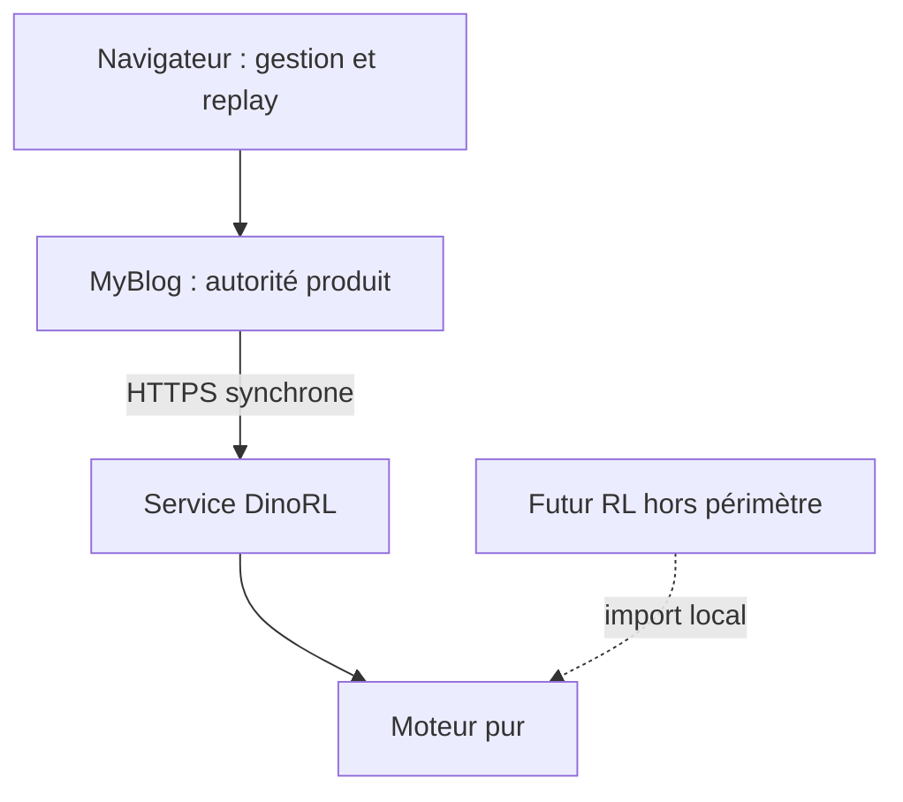
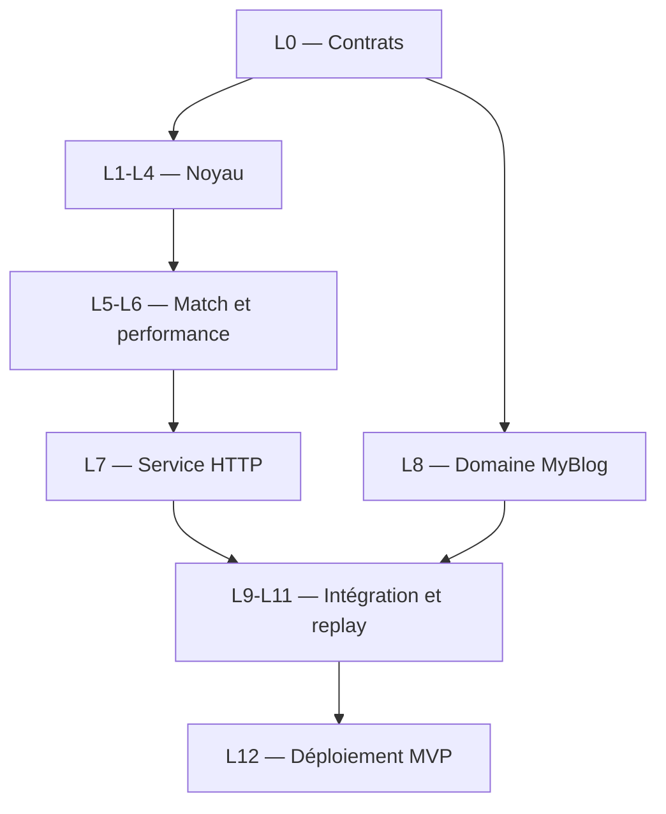

# DinoRL — Spécification et plan d’implémentation

> **Statut : prêt à implémenter**  
> **Périmètre : moteur de jeu, service HTTP, intégration MyBlog et lecteur de replay**  
> **Méthode : test-driven development**  
> **Hors périmètre : entraînement RL, algorithmes RL, PvE, activation du PvP et de l’arène**

## 1. Objet du document

Ce document transforme les règles du **Duel de raptors** en un plan d’implémentation directement exploitable par des agents LLM.

Il sépare :

1. les **spécifications du système**, qui décrivent ce qui doit être livré et le comportement attendu ;
2. les **spécifications techniques**, qui fixent l’architecture, les contrats, les modèles, les tests et le déploiement ;
3. le **plan d’exécution TDD**, qui découpe le travail en tickets ordonnés et vérifiables.

Le livret `duel-de-raptors-regles-du-jeu.md` reste l’unique source de vérité fonctionnelle pour les règles du combat. Le présent document ne le remplace pas.

## 2. Sources de vérité et ordre de priorité

| Source | Autorité |
| --- | --- |
| `duel-de-raptors-regles-du-jeu.md` | Règles fonctionnelles du combat |
| Présent document | Architecture, contrats, périmètre et ordre d’implémentation |
| `schemas/*.json` du dépôt moteur | Contrats machine entre le moteur et MyBlog |
| Fixtures de conformité | Scénarios canoniques communs aux deux dépôts |
| Tests automatisés | Traduction exécutable des règles et contrats |
| Base MyBlog | Utilisateurs, droits, historique, Elo, économie et arène |
| Stockage du serveur moteur | Contrôleurs et futurs artefacts de politiques |

En cas de désaccord :

1. les règles fonctionnelles prévalent sur le code ;
2. le contrat JSON versionné prévaut sur un exemple non normatif ;
3. une modification de règle impose la mise à jour du livret, des fixtures, des schémas et des tests avant celle du moteur ;
4. aucun comportement observé dans l’ancien DinoWars ne devient implicitement une règle de DinoRL.

## 3. Décisions définitives

### 3.1 Produit

- Nom du jeu : **DinoRL**.
- Préfixe d’URL dans MyBlog : `/dinorl/`.
- Nom des modules Python : `dinorl` dans MyBlog et `dinorl_engine` dans le moteur.
- La casse différente est volontaire : `DinoRL` est le nom affiché, les noms de packages restent conformes aux conventions Python et évitent les problèmes de casse entre systèmes.
- Le jeu est conçu uniquement pour un affichage sur ordinateur.
- Le MVP fournit un rendu fonctionnel, sans exigence esthétique.
- Le navigateur utilise uniquement HTML, CSS et JavaScript natifs.
- La grille est rendue avec CSS Grid ; ni Canvas, ni SVG, ni framework JavaScript.
- Le replay avance par changements d’état discrets à intervalle réglable. Aucune interpolation ni animation d’image n’est prévue.

### 3.2 Premier périmètre livrable

Le premier incrément contient :

- le moteur complet conforme aux règles ;
- une carte fixe 9 × 9, identifiée et versionnée ;
- trois bots scriptés déterministes ;
- un exécuteur de combat en ligne de commande ;
- un replay JSON complet et déterministe ;
- un service HTTP synchrone ;
- une application Django indépendante dans MyBlog ;
- une page technique permettant de générer un combat entre deux bots ;
- une activité d’évaluation sans récompense ;
- un lecteur de replay complet ;
- les modèles nécessaires aux futurs snapshots, duels et à l’arène ;
- les écrans PvP et arène derrière des drapeaux de fonctionnalité désactivés, sans lien de navigation et sans appel au moteur.

Le MVP ne contient jamais de PvE.

### 3.3 Déploiement et capacité

- MyBlog reste sur son compte PythonAnywhere gratuit actuel.
- Le service du moteur est hébergé sur un second compte PythonAnywhere gratuit pour le premier incrément.
- L’URL cible est un sous-domaine `https://<compte-moteur>.pythonanywhere.com`.
- Le service est WSGI et synchrone ; aucun WebSocket, ASGI, worker asynchrone ou conteneur n’est nécessaire.
- Le moteur utilise Python 3.12 sur une image PythonAnywhere compatible.
- MyBlog conserve sa version Python actuelle ; l’ajout de DinoRL ne déclenche pas une montée de version globale du monolithe.
- Le moteur du MVP est CPU uniquement.
- Le service web ne lance jamais d’entraînement ni de lot long.
- Le futur entraînement RL utilise le moteur comme bibliothèque locale et pourra s’exécuter sur une autre machine hors ligne. Son ordonnanceur et son stockage sont définis dans un document RL séparé.

Le domaine `.pythonanywhere.com` figure actuellement dans la liste des destinations autorisées pour les comptes gratuits. Cette compatibilité doit néanmoins être vérifiée depuis le compte MyBlog avant le déploiement, car l’accès sortant gratuit passe par une liste d’autorisation ([documentation réseau](https://help.pythonanywhere.com/pages/403ForbiddenError/), [liste actuelle](https://www.pythonanywhere.com/whitelist/)).

### 3.4 Charge cible du MVP

| Mesure | Valeur cible |
| --- | ---: |
| Utilisateurs totaux | 5 |
| Utilisateurs simultanés | 4 |
| Évaluations simultanées par utilisateur | 1 |
| Évaluations réussies par utilisateur et par jour | 20 maximum |
| Appel moteur individuel | connexion ≤ 1 s, attente totale visée ≤ 5 s |
| Matériel | CPU uniquement |
| Futur budget d’entraînement | 4 h maximum par utilisateur, soit 20 h cumulées pour 5 utilisateurs si les tâches sont sérialisées |

Le compte gratuit du service moteur ne fournit qu’un worker web. Les quatre demandes simultanées peuvent donc être mises en file. La validation sur l’hébergement cible doit démontrer que quatre combats demandés en parallèle terminent chacun dans la limite de cinq secondes. Les comptes gratuits PythonAnywhere utilisent actuellement un worker web ([documentation de capacité](https://help.pythonanywhere.com/pages/HowManyHitsCanMySiteHandle/)).

### 3.5 Qualité et gestion des dépôts

- Le moteur est créé dans un nouveau dépôt local `dinorl-engine`.
- L’intégration est développée dans une branche locale dédiée de MyBlog.
- Codex coordonne les espaces de travail et l’intégration.
- Les agents d’implémentation ne créent ni branche, ni commit, ni pull request.
- Le dépôt moteur sera publié ultérieurement sur GitHub sous un compte différent de `PiRom1`.
- Le noyau moteur est typé strictement.
- Couverture minimale : 95 % sur `src/dinorl_engine/core`.
- Couverture minimale : 90 % sur `dinorl/services` dans MyBlog.
- Aucun seuil n’est calculé ni imposé sur le code historique de MyBlog.
- Les secrets existants de MyBlog ne sont pas modifiés dans ce chantier.
- Aucun nouveau secret n’est commité : le jeton DinoRL est fourni uniquement par l’environnement.

# Partie I — Spécifications du système

## 4. Architecture fonctionnelle



### 4.1 Moteur pur

Le moteur pur :

- initialise un combat ;
- expose les actions légales du joueur actif ;
- applique une action atomique ;
- résout automatiquement les transitions de début et de fin de tour ;
- applique toutes les règles de déplacement, boue, morsure, bousculade, repos et carcasses ;
- détecte les fins par K.-O., troisième point ou limite de durée ;
- produit facultativement les événements nécessaires au replay ;
- exécute un combat complet à partir de deux contrôleurs ;
- fonctionne sans Django, ORM, HTTP, base de données ni connaissance des utilisateurs.

Le moteur pur ne :

- calcule pas d’Elo ;
- ne verse pas de monnaie ;
- ne contrôle pas de quota quotidien ;
- ne connaît pas les modes produit ;
- ne charge pas une URL d’artefact fournie par un appelant ;
- n’effectue aucun appel réseau ;
- ne sérialise pas de JSON dans la boucle rapide lorsque le replay est désactivé.

### 4.2 Service HTTP du moteur

Le service :

- authentifie MyBlog ;
- valide le contrat entrant ;
- résout les contrôleurs demandés depuis une liste fermée ;
- exécute un combat complet en mémoire ;
- renvoie le résultat, les versions, les statistiques et le replay ;
- refuse toute version, carte ou contrôleur inconnu ;
- ne conserve aucune donnée économique ou utilisateur.

Il ne reçoit jamais :

- de cookie Django ;
- de mot de passe utilisateur ;
- d’Elo ;
- de solde ;
- de chemin de fichier arbitraire ;
- d’URL d’artefact ;
- de paramètres permettant de modifier les règles officielles.

### 4.3 MyBlog

MyBlog est l’unique autorité pour :

- l’authentification ;
- les permissions ;
- le quota d’évaluation ;
- les profils DinoRL ;
- les métadonnées des snapshots ;
- la visibilité et la conservation des replays ;
- le futur Elo, l’énergie, le champion, les séries et les récompenses ;
- l’historique visible.

MyBlog :

- génère `request_id` et `seed` ;
- appelle le moteur avec une limite de temps courte et sans retry automatique ;
- vérifie le résultat reçu ;
- enregistre le résultat et le replay dans une transaction ;
- sert ensuite le replay sans dépendre de la disponibilité du moteur.

### 4.4 Lecteur de replay

Le lecteur est une projection du JSON enregistré. Il ne réimplémente aucune règle.

Il affiche :

- les 81 cases et leur type ;
- la position des deux raptors ;
- leurs PV, endurance, PM et scores ;
- le joueur actif, le tour individuel et la manche ;
- l’état des trois carcasses ;
- la consommation ou le repos en attente ;
- l’action et les effets du pas courant ;
- le résultat final et sa cause.

Il propose :

- lecture et pause ;
- pas précédent et suivant ;
- début et fin ;
- vitesses 0,25×, 0,5×, 1×, 2× et 4× ;
- journal textuel synchronisé.

À chaque pas, les éléments changent immédiatement d’état. Les propriétés CSS d’animation et de transition ne sont pas nécessaires.

## 5. Carte officielle du MVP

### 5.1 Identité

| Propriété | Valeur |
| --- | --- |
| `map_id` | `arena_mvp_v1` |
| Taille | 9 lignes × 9 colonnes |
| Origine | coin supérieur gauche |
| Coordonnée | `[ligne, colonne]`, indexée à partir de 0 |
| Directions | nord, est, sud, ouest |

### 5.2 Grille canonique

```text
........S
.....M...
..M....BB
C.B.BM...
MM..C..MM
...MB.B.C
BB....M..
...M.....
S........
```

Légende :

| Symbole | Type |
| --- | --- |
| `S` | position de départ |
| `C` | carcasse |
| `M` | mur |
| `B` | boue |
| `.` | case libre |

### 5.3 Objets nommés

| Identifiant | Type | Coordonnée |
| --- | --- | --- |
| `spawn_a` | départ A | `[8, 0]` |
| `spawn_b` | départ B | `[0, 8]` |
| `carcass_left_a` | latérale consommable | `[3, 0]` |
| `carcass_center` | centrale réutilisable | `[4, 4]` |
| `carcass_left_b` | latérale consommable | `[5, 8]` |

La fixture de carte contient également les coordonnées explicites des murs et de la boue. Le moteur ne parse pas la grille textuelle à chaque combat : elle sert de source lisible, puis est compilée en représentation compacte au chargement.

## 6. Contrôleurs du MVP

Le moteur expose exactement trois contrôleurs intégrés :

| Identifiant | Intention | Priorités déterministes |
| --- | --- | --- |
| `aggressive-v1` | Chercher rapidement le contact | mordre si possible ; sinon bousculer si la morsure est impossible faute d’endurance ; sinon suivre le plus court chemin vers l’adversaire ; se reposer si aucune action utile n’est payable |
| `prudent-v1` | Préserver l’endurance et viser une carcasse latérale | se reposer à endurance ≤ 2 si possible ; se nourrir sur une carcasse sûre ; viser la carcasse latérale disponible la plus proche ; mordre si l’adversaire bloque ou menace immédiatement |
| `opportunist-v1` | Exploiter les ouvertures | se nourrir si la carcasse est active et que l’adversaire ne peut pas interrompre au prochain tour ; sinon mordre ; sinon viser la carcasse centrale ; bousculer si cela place l’adversaire dans la boue ou contre un mur |

Règles communes :

- les bots choisissent une action après chaque action précédente de leur propre tour ;
- ils ne voient jamais d’information absente de l’état public ;
- ils utilisent le masque d’actions légales ;
- les chemins utilisent un BFS sur la grille courante ;
- les égalités sont départagées dans l’ordre `NORTH`, `EAST`, `SOUTH`, `WEST` ;
- ils terminent leur tour lorsqu’aucune priorité ne produit d’action utile ;
- aucun tirage aléatoire n’est utilisé dans ces versions ;
- une même entrée produit toujours la même action.

Le prédicat partagé `can_interrupt_next_turn` résout les effets connus du prochain début de tour adverse, calcule au moyen d’un chemin pondéré le coût minimal pour atteindre une case adjacente, réserve 1 PM pour `BITE` ou `SHOVE`, puis vérifie l’endurance correspondante. Il ne prédit aucun choix futur et ne consulte aucune donnée cachée.

Ces bots servent à valider le moteur, les replays et l’intégration. Leur niveau de jeu n’est pas un critère d’acceptation.

## 7. Activités du produit

| Activité | MVP | Contrôleurs | Récompense | Visibilité |
| --- | ---: | --- | ---: | --- |
| Replay technique | Oui | deux bots | aucune | membres, génération réservée au staff |
| Évaluation | Oui | deux contrôleurs éligibles ; bots uniquement avant le RL | aucune | publique au MVP |
| PvE | Jamais | — | — | — |
| Duel PvP | Écran dormant | futurs snapshots | non défini ici | membres après activation |
| Arène | Écran dormant | futurs snapshots | non défini ici | membres après activation |

Un écran dormant :

- possède un template et des tests de rendu ;
- n’apparaît pas dans la navigation ;
- renvoie 404 tant que son drapeau de fonctionnalité est faux ;
- n’appelle pas le moteur ;
- ne modifie aucune donnée métier.

## 8. Parcours d’une évaluation

1. Un utilisateur authentifié ouvre `/dinorl/evaluations/new/`.
2. MyBlog vérifie qu’il n’a pas d’évaluation `pending` et qu’il a moins de 20 évaluations réussies pour la journée du site.
3. L’utilisateur sélectionne deux contrôleurs éligibles.
4. MyBlog génère un UUID `request_id` et une graine entière signée sur 63 bits.
5. MyBlog crée un `DinoRLFight` au statut `pending`.
6. MyBlog appelle le moteur en HTTPS, sans retry, avec connexion limitée à une seconde et attente globale visée à cinq secondes.
7. Le moteur exécute le combat et renvoie le replay complet.
8. MyBlog vérifie le schéma, les versions, le `request_id`, les contrôleurs, le hash du replay et les invariants de résumé.
9. Dans une transaction courte, MyBlog passe le combat à `completed` et enregistre le replay.
10. MyBlog redirige vers `/dinorl/fights/<request_id>/`.
11. Le navigateur lit le replay enregistré dans MyBlog.

En cas d’échec :

- le combat passe à `failed` avec un code non sensible ;
- aucun combat réussi n’est décompté du quota ;
- aucune récompense ni conséquence sociale n’est appliquée ;
- l’utilisateur peut relancer une nouvelle demande ;
- le corps de réponse invalide n’est pas enregistré dans la base.

## 9. Frontière minimale avec le RL

Le présent chantier fournit seulement :

- un protocole `Controller` remplaçable ;
- un mode de moteur sans replay ;
- une API locale `reset`, `legal_actions`, `step`, `result` ;
- des versions de règles, carte, observation et action ;
- des métadonnées de snapshot dans MyBlog ;
- des identifiants d’artefacts opaques et des SHA-256.

Le présent chantier ne définit pas :

- l’algorithme d’apprentissage ;
- le réseau neuronal ;
- les observations numériques du modèle ;
- les récompenses de shaping ;
- le budget précis de transitions ;
- la parallélisation des environnements d’entraînement ;
- les branches et promotions de politiques ;
- l’ordonnanceur d’entraînement ;
- le format binaire des poids.

Les pas d’apprentissage ne transitent jamais par HTTP. Le futur entraîneur importe `dinorl_engine.core` localement.

# Partie II — Spécifications techniques

## 10. Contraintes observées dans MyBlog

L’intégration cible le dépôt [PiRom1/MyBlog](https://github.com/PiRom1/MyBlog), audité au commit `b127457acb5757fbc6d39895f4e345f53d74305c`.

- Il s’agit d’un monolithe Django utilisant templates, CSS et JavaScript natifs.
- `Blog.models` contient déjà un grand nombre de domaines ; DinoRL ne doit pas y ajouter ses modèles.
- Django REST Framework est présent, mais n’est pas nécessaire pour les pages serveur rendues de DinoRL.
- Les anciens consumers, dictionnaires globaux et chemins WebSocket ne sont pas réutilisés.
- Les modèles `DWUser`, `DWArena` et `DWFight` constituent une référence produit, pas une structure à étendre.
- La logique DinoWars présente dans les vues ne doit pas être copiée dans les vues DinoRL.
- SQLite est la base actuellement configurée ; les contraintes retenues doivent être testées sur SQLite.
- Les paramètres et secrets historiques restent hors du périmètre de ce chantier.

Réutilisations autorisées :

- le modèle utilisateur existant ;
- le solde de diplodocoins lors du futur lot arène ;
- le journal social lors du futur changement de champion ;
- les conventions visuelles et de navigation du site ;
- l’idée fonctionnelle d’énergie, d’Elo, de champion et de série.

Réutilisations interdites :

- héritage ou clé étrangère vers `DWUser`, `DWArena` ou `DWFight` ;
- `GLOBAL_STATE` ;
- moteur ou logs de combat DinoWars ;
- participants stockés uniquement comme chaînes de noms ;
- calcul d’Elo ou de récompense dans une vue Django.

## 11. Dépôts et arborescences cibles

### 11.1 Dépôt `dinorl-engine`

```text
dinorl-engine/
├── AGENTS.md
├── README.md
├── pyproject.toml
├── requirements.lock
├── requirements-dev.lock
├── src/
│   └── dinorl_engine/
│       ├── __init__.py
│       ├── core/
│       │   ├── __init__.py
│       │   ├── actions.py
│       │   ├── constants.py
│       │   ├── engine.py
│       │   ├── errors.py
│       │   ├── events.py
│       │   ├── maps.py
│       │   ├── state.py
│       │   └── validation.py
│       ├── controllers/
│       │   ├── __init__.py
│       │   ├── protocol.py
│       │   └── scripted.py
│       ├── match/
│       │   ├── __init__.py
│       │   ├── replay.py
│       │   └── runner.py
│       ├── service/
│       │   ├── __init__.py
│       │   ├── api.py
│       │   ├── auth.py
│       │   ├── errors.py
│       │   └── schemas.py
│       └── cli.py
├── schemas/
│   ├── simulate-request-v1.schema.json
│   ├── simulate-response-v1.schema.json
│   └── replay-v1.schema.json
├── fixtures/
│   ├── maps/arena_mvp_v1.json
│   ├── rules/
│   └── matches/
├── benchmarks/
│   ├── benchmark_matches.py
│   └── README.md
├── tests/
│   ├── unit/
│   ├── rules/
│   ├── properties/
│   ├── contracts/
│   ├── integration/
│   └── performance/
└── deploy/
    ├── pythonanywhere_wsgi.py
    └── README.md
```

### 11.2 Application `dinorl` dans MyBlog

```text
dinorl/
├── __init__.py
├── admin.py
├── apps.py
├── forms.py
├── models.py
├── urls.py
├── choices.py
├── contracts/
│   ├── simulate-response-v1.schema.json
│   └── replay-v1.schema.json
├── services/
│   ├── __init__.py
│   ├── engine_client.py
│   ├── evaluations.py
│   ├── fights.py
│   ├── replay_retention.py
│   └── replay_validation.py
├── views/
│   ├── __init__.py
│   ├── arena.py
│   ├── evaluations.py
│   ├── fights.py
│   ├── home.py
│   └── pvp.py
├── templates/dinorl/
│   ├── arena_disabled.html
│   ├── evaluation_form.html
│   ├── fight_detail.html
│   ├── home.html
│   ├── pvp_disabled.html
│   └── technical_demo.html
├── static/dinorl/
│   ├── replay.css
│   └── replay.js
├── management/commands/
│   └── purge_dinorl_replays.py
├── migrations/
└── tests/
    ├── contracts/
    ├── fixtures/
    ├── test_engine_client.py
    ├── test_evaluations.py
    ├── test_models.py
    ├── test_permissions.py
    ├── test_replay_retention.py
    └── test_views.py
```

Modifications externes minimales dans MyBlog :

- ajouter `dinorl.apps.DinoRLConfig` à `INSTALLED_APPS` ;
- ajouter `path("dinorl/", include("dinorl.urls"))` ;
- ajouter les réglages DinoRL ;
- ajouter `requests` et `jsonschema` aux dépendances d’exécution, puis `pytest`, `pytest-django` et `pytest-cov` aux dépendances de test ;
- appeler la purge DinoRL depuis la tâche quotidienne existante seulement après validation de la commande isolée.

Le dépôt moteur fige ses dépendances transitives dans les deux fichiers `requirements*.lock`. MyBlog conserve pour ce chantier sa stratégie historique de dépendances ; il ne faut pas transformer l’ensemble de son `requirements.txt` en lockfile dans un ticket DinoRL.

## 12. Versions initiales

| Élément | Version initiale |
| --- | --- |
| Protocole HTTP | `1.0.0` |
| Règles | `1.0.0` |
| Carte | `arena_mvp_v1` |
| Actions | `1.0.0` |
| Observation publique | `1.0.0` |
| Replay | `1.0.0` |

Les versions sont des chaînes explicites. Une modification cassant un schéma ou une sémantique incrémente la version majeure correspondante. Le moteur ne tente aucune conversion implicite.

## 13. Représentation du moteur

### 13.1 Principes

- Les types du noyau utilisent `dataclass(slots=True)` ou des structures de coût équivalent.
- Les enums du chemin critique utilisent des valeurs entières stables.
- La grille est aplatie sur 81 cases.
- Un environnement possède un état mutable interne afin d’éviter une copie complète par action.
- `snapshot_public()` produit une représentation immuable uniquement lorsque le replay ou un test la demande.
- Une action invalide lève `IllegalActionError` avant toute mutation.
- Le noyau ne dépend que de la bibliothèque standard Python.

### 13.2 Enums

```text
Action
  MOVE_NORTH
  MOVE_EAST
  MOVE_SOUTH
  MOVE_WEST
  BITE
  SHOVE
  FEED
  REST
  END_TURN

Tile
  EMPTY
  WALL
  MUD
  CARCASS

Actor
  A
  B

EndReason
  KO
  CARCASS_SCORE
  ROUND_LIMIT
```

### 13.3 État minimal

`GameState` contient :

- versions et `map_id` ;
- `seed` ;
- acteur ayant commencé ;
- acteur actif ;
- index absolu du tour individuel, à partir de 0 ;
- numéro de manche, à partir de 1 ;
- état terminal, vainqueur éventuel et cause ;
- pour chaque raptor : position, PV, endurance, PM, score, action principale disponible, déplacement volontaire effectué, repos en attente, consommation en attente ;
- pour chaque carcasse latérale : disponible ou consommée ;
- pour la carcasse centrale : active, en attente ou en recharge ;
- éventuel index de tour auquel la carcasse centrale se réactive.

Le compteur absolu de tour évite les ambiguïtés de recharge. Lorsqu’un point central est validé au début du tour `t`, la carcasse reçoit `reactivate_on_turn = t + 2`. Elle est donc inactive pendant les tours `t` et `t + 1`, puis se réactive au début de `t + 2`.

### 13.4 API locale

```python
env = DinoRLEnv(map_id="arena_mvp_v1", seed=seed, replay=False)
state = env.reset(first_actor=None)
actions = env.legal_actions()
transition = env.step(action)
terminal = env.is_terminal
result = env.result
```

Contraintes :

- `first_actor=None` utilise la graine pour choisir A ou B ;
- fournir explicitement A ou B est permis dans les tests et évaluations miroir ;
- `legal_actions()` renvoie un masque de longueur fixe dans l’ordre de l’enum ;
- `step()` n’accepte qu’une action du joueur actif ;
- une partie terminale refuse tout nouveau `step()` ;
- le mode `replay=False` n’alloue aucun dictionnaire d’événement ni snapshot public.

## 14. Transitions automatiques

### 14.1 Début de tour

Le moteur exécute exactement cet ordre :

1. valider ou constater l’interruption de la consommation de l’acteur actif ;
2. attribuer le point éventuel ;
3. vérifier la victoire à trois points ;
4. résoudre le repos en attente ;
5. réactiver éventuellement la carcasse centrale ;
6. remettre les PM à 3 ;
7. réinitialiser `main_action_available=True` et `voluntary_move_done=False` ;
8. ouvrir le tour si la partie n’est pas terminée.

### 14.2 Fin de tour

`FEED`, `REST` et `END_TURN` ferment immédiatement le tour. Après `BITE` ou `SHOVE`, le joueur peut continuer à se déplacer ou terminer son tour.

À la fermeture :

1. perdre les PM non utilisés ;
2. si l’acteur était le second joueur de la manche 30, terminer par `ROUND_LIMIT` ;
3. sinon passer la main ;
4. incrémenter le tour individuel et, si nécessaire, la manche ;
5. exécuter les transitions de début du nouveau tour.

Une victoire immédiate arrête la séquence avant tout événement différé ultérieur.

Un tour contient au maximum trois actions consommant des PM, puis éventuellement `END_TURN`. Le runner impose donc une borne défensive de quatre actions demandées par tour ; son dépassement indique un bug de contrôleur et arrête l’exécution avec une erreur technique.

## 15. Actions légales

Le masque est calculé à partir de l’état courant.

| Action | Conditions principales |
| --- | --- |
| Déplacement | destination interne, non murale, non occupée ; PM suffisants ; 2 PM si la case de départ est de boue |
| `BITE` | action principale disponible ; adversaire adjacent ; ≥ 1 PM ; ≥ 2 endurance |
| `SHOVE` | action principale disponible ; adversaire adjacent ; ≥ 1 PM ; ≥ 1 endurance |
| `FEED` | action principale disponible ; carcasse active sous le raptor ; ≥ 2 endurance |
| `REST` | action principale disponible ; aucun déplacement volontaire pendant le tour |
| `END_TURN` | toujours légal tant que la partie n’est pas terminale |

Un déplacement forcé par bousculade n’est jamais considéré comme un déplacement volontaire du raptor déplacé.

## 16. Bousculade

La direction est déduite du vecteur attaquant → cible. La résolution se fait une case à la fois, au maximum deux fois.

Pour chaque étape :

1. si la case suivante est hors grille ou un mur, arrêter et infliger exactement 1 dégât de collision pour l’ensemble de la bousculade ;
2. sinon déplacer la cible ;
3. si la nouvelle case est de boue, arrêter sans résoudre l’étape restante ;
4. sinon continuer si une seconde étape reste.

Comme il n’existe que deux raptors et que l’attaquant se trouve derrière la cible, aucune troisième collision de raptor n’est à traiter dans le MVP.

La consommation de la cible est interrompue dès que `SHOVE` est légalement résolue, même si la première case est bloquée. Le K.-O. par collision est vérifié immédiatement.

## 17. Replay version 1

### 17.1 Principes

- JSON UTF-8 strict ;
- clés en `snake_case` ;
- ordre des événements défini par `seq` ;
- aucun nombre flottant nécessaire ;
- état public complet après chaque événement visible ;
- hash SHA-256 calculé sur la sérialisation JSON canonique du seul objet `replay` ;
- taille non compressée maximale de l’objet replay : 480 Kio ;
- taille non compressée maximale de la réponse HTTP complète : 512 Kio ;
- objectif de taille p95 : 256 Kio ou moins.

### 17.2 Types d’événements

| Type | Production |
| --- | --- |
| `match_started` | après initialisation |
| `turn_started` | après toutes les transitions automatiques de début de tour |
| `action_resolved` | après chaque action utilisateur ou bot |
| `match_ended` | immédiatement après la condition terminale |

Les transitions automatiques sont regroupées dans l’événement `turn_started` via une liste `automatic_effects`. Elles ne créent pas plusieurs états identiques inutiles.

L’interruption d’une consommation est un effet de l’événement `action_resolved` de la morsure ou de la bousculade ; ce n’est pas un événement autonome.

Avec au plus 60 tours individuels et quatre actions enregistrées par tour, un replay contient au plus 302 événements : un début de match, 60 débuts de tour, 240 actions et une fin de match.

### 17.3 Structure conceptuelle

```json
{
  "replay_version": "1.0.0",
  "rules_version": "1.0.0",
  "action_version": "1.0.0",
  "observation_version": "1.0.0",
  "engine_version": "0.1.0",
  "map_id": "arena_mvp_v1",
  "seed": 12345,
  "first_actor": "A",
  "controllers": {
    "A": {"kind": "scripted", "id": "aggressive-v1"},
    "B": {"kind": "scripted", "id": "prudent-v1"}
  },
  "events": [
    {
      "seq": 0,
      "type": "match_started",
      "round": 1,
      "turn": 0,
      "actor": "A",
      "action": null,
      "cost": {"movement": 0, "endurance": 0},
      "effects": [],
      "state": {}
    }
  ],
  "result": {
    "winner": "A",
    "reason": "ko",
    "rounds_completed": 8,
    "individual_turns": 15
  }
}
```

Le schéma JSON complet est écrit avant le sérialiseur. L’objet `state` est décrit par `$defs/public_state` dans le schéma.

### 17.4 Reproductibilité

Deux exécutions avec :

- mêmes versions ;
- même carte ;
- mêmes contrôleurs déterministes ;
- même graine ;

doivent produire le même résultat, les mêmes actions et le même hash de replay.

Une fixture de « replay doré » vérifie ce contrat. Les tests de règles ne doivent toutefois pas tous dépendre d’un gros fichier doré fragile.

## 18. Contrat HTTP version 1

### 18.1 Transport

- HTTPS uniquement en production ;
- `Content-Type: application/json` ;
- corps de requête maximal : 32 Kio ;
- corps de réponse maximal côté MyBlog : 512 Kio ;
- encodage UTF-8 ;
- aucun retry automatique pour `POST /v1/matches/simulate` ;
- `User-Agent: MyBlog-DinoRL/<version>`.

### 18.2 Authentification

La requête contient :

```http
Authorization: Bearer <DINORL_ENGINE_TOKEN>
```

Le jeton :

- contient au moins 32 octets aléatoires ;
- est fourni par variable d’environnement sur les deux serveurs ;
- est distinct de `SECRET_KEY`, des mots de passe et des autres secrets historiques ;
- est comparé en temps constant ;
- n’est jamais journalisé ;
- peut être remplacé en configurant temporairement un jeton courant et un jeton précédent côté moteur.

Une signature HMAC par requête n’est pas nécessaire au MVP : l’opération moteur est déterministe et sans effet économique. L’idempotence et l’autorité du résultat restent dans MyBlog.

### 18.3 Santé

```http
GET /health
```

Réponse `200` :

```json
{
  "status": "ok",
  "engine_version": "0.1.0",
  "protocol_versions": ["1.0.0"],
  "rules_versions": ["1.0.0"],
  "maps": ["arena_mvp_v1"]
}
```

La route ne retourne ni secret, ni chemin local, ni exception.

### 18.4 Simulation

```http
POST /v1/matches/simulate
```

Requête :

```json
{
  "protocol_version": "1.0.0",
  "request_id": "014f69a0-23d1-4f41-a540-3ce73ac646bd",
  "rules_version": "1.0.0",
  "map_id": "arena_mvp_v1",
  "seed": 12345,
  "controllers": {
    "A": {"kind": "scripted", "id": "aggressive-v1"},
    "B": {"kind": "scripted", "id": "opportunist-v1"}
  },
  "include_replay": true
}
```

Le client ne peut pas fournir les PV, l’endurance, les PM, la limite de manches ou la grille.

Réponse `200` :

```json
{
  "protocol_version": "1.0.0",
  "request_id": "014f69a0-23d1-4f41-a540-3ce73ac646bd",
  "engine_version": "0.1.0",
  "rules_version": "1.0.0",
  "map_id": "arena_mvp_v1",
  "replay_version": "1.0.0",
  "result": {
    "winner": "A",
    "reason": "carcass_score",
    "score_a": 3,
    "score_b": 1,
    "hp_a": 2,
    "hp_b": 4,
    "rounds_completed": 12,
    "individual_turns": 23,
    "actions": 57
  },
  "replay_sha256": "<64 caractères hexadécimaux>",
  "replay": {}
}
```

### 18.5 Erreurs

| HTTP | `code` | Cas |
| ---: | --- | --- |
| 400 | `invalid_json` | JSON illisible |
| 401 | `unauthorized` | jeton absent ou invalide |
| 413 | `request_too_large` | taille dépassée |
| 422 | `schema_validation_failed` | contrat invalide |
| 422 | `unknown_controller` | contrôleur hors liste |
| 409 | `unsupported_version` | version ou carte incompatible |
| 500 | `simulation_failed` | erreur interne non détaillée |

Format :

```json
{
  "error": {
    "code": "unsupported_version",
    "message": "Requested rules version is not supported.",
    "request_id": "014f69a0-23d1-4f41-a540-3ce73ac646bd"
  }
}
```

Les traces complètes restent dans les logs serveur et ne sont jamais renvoyées à MyBlog.

## 19. Client moteur dans MyBlog

### 19.1 Configuration

```text
DINORL_ENGINE_BASE_URL
DINORL_ENGINE_TOKEN
DINORL_ENGINE_CONNECT_TIMEOUT_SECONDS=1
DINORL_ENGINE_TOTAL_TIMEOUT_SECONDS=5
DINORL_ENGINE_MAX_RESPONSE_BYTES=524288
DINORL_ENABLE_PVP=false
DINORL_ENABLE_ARENA=false
DINORL_REPLAY_RETENTION_DAYS=7
DINORL_EVALUATIONS_PER_DAY=20
```

Les réglages non secrets possèdent des valeurs par défaut. L’URL et le jeton sont obligatoires hors tests.

Le service moteur possède en plus `DINORL_ENGINE_PREVIOUS_TOKEN`, facultatif et temporaire pendant une rotation. MyBlog n’utilise que le jeton courant.

### 19.2 Comportement

`EngineClient.simulate(request)` :

- utilise un client HTTP synchrone réutilisable ;
- désactive les retries automatiques ;
- borne la connexion à une seconde ;
- borne l’attente totale visée à cinq secondes ;
- lit la réponse par morceaux et s’arrête au-delà de 512 Kio ;
- refuse un type MIME inattendu ;
- valide d’abord le schéma, puis les invariants métier de réponse ;
- retourne un objet typé, jamais un dictionnaire non validé ;
- transforme les erreurs réseau en exceptions applicatives fermées.

Exceptions exposées au service métier :

```text
EngineUnavailable
EngineTimeout
EngineUnauthorized
EngineContractError
EngineVersionError
EngineResponseTooLarge
```

La vue ne capture pas directement les exceptions de la bibliothèque HTTP.

## 20. Modèle de données MyBlog

Tous les modèles vivent dans `dinorl.models`. Les noms ci-dessous sont définitifs pour le MVP.

### 20.1 `DinoRLProfile`

| Champ | Type / règle |
| --- | --- |
| `user` | `OneToOneField(User, CASCADE)`, clé fonctionnelle |
| `elo` | entier, défaut 1000 |
| `wins` | entier positif, défaut 0 |
| `losses` | entier positif, défaut 0 |
| `draws` | entier positif, défaut 0 |
| `arena_energy` | entier positif, défaut 5 |
| `created_at` | date automatique |
| `updated_at` | date automatique |

Ces champs sociaux sont dormants au MVP. Aucune vue d’évaluation ne les modifie.

### 20.2 `DinoRLPolicySnapshot`

| Champ | Type / règle |
| --- | --- |
| `id` | UUID, clé primaire |
| `owner` | FK `User`, `PROTECT` |
| `display_name` | chaîne 80 caractères |
| `artifact_id` | chaîne opaque 255 caractères, unique |
| `artifact_sha256` | 64 caractères hexadécimaux |
| `engine_version` | chaîne 32 |
| `rules_version` | chaîne 32 |
| `observation_version` | chaîne 32 |
| `status` | `preparing`, `ready`, `invalid`, `archived` |
| `created_at` | date automatique |
| `updated_at` | date automatique |

Les poids ne sont jamais enregistrés dans MyBlog. Le chargement effectif d’un snapshot par le moteur est hors du premier incrément.

### 20.3 `DinoRLFight`

| Champ | Type / règle |
| --- | --- |
| `request_id` | UUID, clé primaire |
| `requested_by` | FK `User`, `PROTECT` |
| `mode` | `technical`, `evaluation`, `pvp`, `arena` |
| `status` | `pending`, `completed`, `failed` |
| `visibility` | `public`, `members`, `private` |
| `controller_a_kind` | `scripted` ou `snapshot` |
| `controller_a_ref` | identifiant opaque |
| `snapshot_a` | FK nullable vers snapshot, `PROTECT` |
| `controller_b_kind` | `scripted` ou `snapshot` |
| `controller_b_ref` | identifiant opaque |
| `snapshot_b` | FK nullable vers snapshot, `PROTECT` |
| `seed` | entier positif limité à 63 bits |
| `first_actor` | `A`, `B` ou vide avant résultat |
| `engine_version` | chaîne 32 |
| `rules_version` | chaîne 32 |
| `map_id` | chaîne 64 |
| `replay_version` | chaîne 32 |
| `winner` | `A`, `B`, `draw` ou vide |
| `end_reason` | `ko`, `carcass_score`, `round_limit` ou vide |
| `score_a`, `score_b` | entiers positifs |
| `hp_a`, `hp_b` | entiers positifs |
| `rounds_completed` | entier positif |
| `individual_turns` | entier positif |
| `action_count` | entier positif |
| `replay` | `JSONField`, nullable après purge |
| `replay_sha256` | 64 caractères, vide avant résultat |
| `replay_size_bytes` | entier positif, défaut 0 |
| `replay_purged_at` | date nullable |
| `failure_code` | code fermé, jamais une trace |
| `business_applied_at` | date nullable, réservée aux futurs modes sociaux |
| `created_at`, `completed_at` | dates |

Contraintes et index :

- clé primaire sur `request_id` ;
- index `(requested_by, mode, created_at)` ;
- index `(status, created_at)` ;
- index `(visibility, completed_at)` ;
- contrainte conditionnelle empêchant deux évaluations `pending` pour le même utilisateur ;
- cohérence contrôleur : un contrôleur `snapshot` exige sa FK, un contrôleur `scripted` interdit sa FK ;
- un combat `completed` exige résultat, versions, hash et replay tant qu’il n’est pas purgé ;
- un combat `failed` interdit toute application métier.

### 20.4 `DinoRLArenaEntry`

| Champ | Type / règle |
| --- | --- |
| `id` | UUID, clé primaire |
| `owner` | FK `User`, `PROTECT` |
| `snapshot` | FK `DinoRLPolicySnapshot`, `PROTECT` |
| `entered_at` | date |
| `left_at` | date nullable |
| `win_streak` | entier positif, défaut 0 |
| `is_active` | booléen |

Une contrainte conditionnelle autorise une seule ligne `is_active=True`. Le modèle est créé au MVP, mais aucun service ne change encore le champion.

## 21. Idempotence et transactions

### 21.1 Côté moteur

Le moteur est sans état métier. Répéter une requête avec le même `request_id`, la même graine et les mêmes contrôleurs recalcule le même résultat. Il ne verse rien et n’enregistre aucun combat.

### 21.2 Côté MyBlog

MyBlog crée la ligne `pending` avant l’appel distant, puis ferme la transaction. L’appel réseau n’a jamais lieu à l’intérieur d’une transaction de base longue.

Après réception :

1. ouvrir `transaction.atomic()` ;
2. relire le combat par sa clé ;
3. si `completed`, retourner le combat existant sans nouvelle application ;
4. si `failed`, refuser l’application tardive ;
5. vérifier à nouveau la réponse ;
6. enregistrer résultat et replay ;
7. marquer `completed` ;
8. appliquer les conséquences métier seulement pour un futur mode qui les définit ;
9. valider.

Le MVP d’évaluation n’applique aucune conséquence métier. `business_applied_at` reste nul.

## 22. Quotas et concurrence

- Le quota porte sur les évaluations `completed` dont `completed_at` appartient à la journée du fuseau configuré dans MyBlog.
- La limite est 20 par utilisateur et par jour.
- Une évaluation `pending` bloque toute nouvelle évaluation du même utilisateur.
- Une erreur moteur passe la demande à `failed` et libère immédiatement le verrou logique.
- Une commande d’administration peut marquer `failed` une demande `pending` plus vieille de dix minutes ; ce cas protège contre un arrêt brutal du worker entre création et finalisation.
- Les combats techniques staff ne consomment pas le quota utilisateur.
- Aucune file de tâches n’est introduite pour le MVP.

## 23. Visibilité et conservation

### 23.1 Politique initiale

- Évaluation MVP : `public`.
- Replay technique : `members`.
- Futurs duels et arène : `members`.
- La politique future pourra rendre les évaluations privées sans migration grâce au champ `visibility`.

### 23.2 Rétention

Valeur d’exploitation initiale : 7 jours de replay JSON, configurable par `DINORL_REPLAY_RETENTION_DAYS`.

La purge :

- conserve la ligne `DinoRLFight` et son résumé ;
- remplace seulement `replay` par `NULL` ;
- renseigne `replay_purged_at` ;
- conserve le hash et la taille ;
- ne purge jamais un combat `pending` ;
- accepte `--dry-run` et `--batch-size` ;
- peut être lancée par la tâche quotidienne existante.

Après les 100 premiers replays, mesurer : moyenne, p50, p95, maximum et volume quotidien. La rétention peut ensuite être ajustée sans changement de schéma.

## 24. Interface MyBlog

### 24.1 URLs

| URL | Accès | Fonction |
| --- | --- | --- |
| `/dinorl/` | membre | accueil et historique autorisé |
| `/dinorl/demo/` | staff | générer un replay technique entre bots |
| `/dinorl/evaluations/new/` | membre | lancer une évaluation |
| `/dinorl/fights/<uuid>/` | selon visibilité | lire résultat et replay |
| `/dinorl/pvp/` | 404 si désactivé | écran dormant PvP |
| `/dinorl/arena/` | 404 si désactivé | écran dormant arène |

### 24.2 Sécurité web

- Toutes les créations sont des `POST` protégés par CSRF.
- Le choix d’un contrôleur provient d’un champ fermé, puis est revalidé côté serveur.
- Le navigateur ne transmet jamais de résultat de combat à enregistrer.
- Le JSON du replay est injecté avec le mécanisme d’échappement sûr de Django, jamais par concaténation dans un script.
- La page refuse un replay absent ou purgé et affiche uniquement le résumé disponible.
- Le jeton du moteur n’apparaît ni dans le contexte template, ni dans le JavaScript, ni dans les logs applicatifs.

### 24.3 Lecteur

`replay.js` :

- valide les champs minimaux avant lecture ;
- maintient seulement l’index courant et une référence au replay ;
- rend directement `event.state` ;
- n’effectue aucun calcul de dégâts, de poussée, de PM ou de score ;
- annule son timer lors d’une pause, d’un changement de vitesse ou d’une navigation manuelle ;
- désactive les boutons aux bornes ;
- rend le journal accessible au clavier.

Les tests JavaScript peuvent être écrits avec le framework déjà disponible dans le dépôt. Si aucun environnement JS de test n’existe, la logique de lecture est gardée dans de petites fonctions pures testées avec un runner minimal ; l’ajout d’une chaîne Node lourde n’est pas requis pour le MVP.

## 25. Service et déploiement PythonAnywhere

### 25.1 Framework

Le service utilise Flask en WSGI avec un schéma de validation explicite. FastAPI/ASGI n’est pas retenu : le service n’a qu’un endpoint de calcul synchrone et PythonAnywhere n’a pas besoin de son hébergement ASGI expérimental pour ce cas.

### 25.2 Préconditions de déploiement

1. Le compte moteur utilise une image système proposant Python 3.12 ([versions Python prises en charge](https://help.pythonanywhere.com/pages/PythonVersions/)).
2. Le virtualenv installe `dinorl-engine` depuis le dépôt local transféré.
3. La configuration WSGI importe uniquement l’application Flask.
4. `DINORL_ENGINE_TOKEN` est défini hors dépôt.
5. MyBlog peut joindre `GET /health` sur le sous-domaine moteur depuis une console du compte web.
6. Un POST authentifié de bout en bout termine en moins de cinq secondes.
7. Quatre POST parallèles respectent encore cette limite.

### 25.3 Limite explicite pour le futur RL

Un compte gratuit ne convient pas à un ordonnanceur d’entraînement de quatre heures par utilisateur : les tâches toujours actives sont réservées aux comptes payants, et les tâches planifiées gratuites admissibles sont limitées selon l’âge du compte et peuvent être bornées à deux heures ([tâches permanentes](https://help.pythonanywhere.com/pages/AlwaysOnTasks/), [tâches planifiées](https://help.pythonanywhere.com/pages/ScheduledTasks/)).

Cette contrainte ne bloque pas le MVP :

- l’API ne calcule que des combats individuels rapides ;
- le futur entraînement s’exécutera hors de la requête web ;
- l’hôte RL définitif sera décidé dans le document RL ;
- les snapshots prêts pourront ensuite être transférés vers le stockage du moteur selon un protocole futur.

## 26. Sécurité dans le périmètre accepté

Les secrets historiques de MyBlog ne sont ni déplacés, ni renouvelés par ce chantier, conformément au périmètre décidé.

Cela ne dispense pas DinoRL des règles suivantes :

- aucun nouveau secret en dur ;
- jeton moteur uniquement par environnement ;
- détection de secret complète dans le nouveau dépôt moteur ;
- détection limitée aux nouveaux fichiers DinoRL et au diff de la branche dans MyBlog, afin de ne pas bloquer sur l’historique existant ;
- logs structurés sans en-tête d’autorisation, cookie, replay complet ou artefact ;
- dépendances minimales et épinglées dans le moteur ;
- endpoint de simulation fermé aux contrôleurs connus ;
- limite de taille et de durée ;
- aucun appel de fichier ou de commande dérivé d’une chaîne fournie par MyBlog.

## 27. Performance

### 27.1 Mesures obligatoires avant optimisation native

Le benchmark exécute des combats avec :

- `replay=False` ;
- carte `arena_mvp_v1` ;
- paires fixes des trois bots ;
- liste fixe de graines ;
- 1, 2, 4 puis 8 processus ;
- échauffement séparé ;
- au moins cinq répétitions mesurées.

Il publie :

- combats par seconde ;
- actions par seconde ;
- temps moyen et p95 par combat ;
- accélération par nombre de processus ;
- mémoire maximale par processus ;
- version Python, CPU et système.

Le premier résultat correct devient la baseline, pas une promesse de débit arbitraire. Le seuil réellement nécessaire sera calculé dans le document RL à partir du budget quotidien d’entraînement et de la fenêtre maximale de quatre heures par utilisateur.

### 27.2 Ordre d’optimisation

1. profiler ;
2. supprimer allocations et sérialisations du chemin sans replay ;
3. aplatir les structures critiques ;
4. exécuter les lots dans un même processus ;
5. utiliser plusieurs processus ;
6. mesurer la part moteur face à l’inférence ;
7. seulement ensuite étudier Cython, C++ ou une autre extension native.

Une implémentation native est interdite tant que le noyau Python n’est pas conforme aux tests et que le benchmark ne démontre pas qu’il empêche d’atteindre le budget RL.

## 28. Stratégie TDD

### 28.1 Boucle obligatoire

Pour chaque ticket :

1. identifier la règle ou le contrat ;
2. écrire un test ciblé qui échoue pour la bonne raison ;
3. exécuter ce test et conserver le constat d’échec dans le compte rendu ;
4. implémenter le minimum ;
5. faire passer le test ;
6. ajouter cas limites et propriétés ;
7. exécuter la suite du périmètre ;
8. refactoriser sans changer le comportement ;
9. exécuter les commandes de validation du ticket.

Un agent ne modifie pas un test pour faire accepter un comportement contraire au livret. Toute ambiguïté fonctionnelle bloque le ticket et remonte au coordinateur.

### 28.2 Matrice de conformité des règles

| Domaine | Cas minimaux obligatoires |
| --- | --- |
| Initialisation | 6 PV, 5 endurance, 3 PM, scores nuls, spawns corrects, premier joueur déterministe par graine |
| Déplacement | quatre directions, limites, murs, case adverse, coût normal, sortie de boue à 2 PM |
| Action principale | une seule par tour, déplacement libre avant/après morsure ou poussée, reset au tour suivant |
| Morsure | coûts, adjacency, 2 dégâts, interruption, K.-O. immédiat |
| Bousculade | deux cases, blocage première/seconde case, 1 dégât maximum, arrêt dans la boue, interruption, K.-O. collision |
| Repos | interdit après déplacement volontaire, fin immédiate, restauration au prochain tour, non-interruption |
| Nourriture | coût, fin de tour, point différé, interruption par morsure/poussée, aucun remboursement |
| Latérales | disparition après validation, disponibilité après interruption, jamais de réactivation |
| Centrale | attente, validation, deux tours d’inactivité, réactivation au bon début de tour, pas de recharge après interruption |
| Victoire | K.-O. prioritaire, troisième point au début du tour, aucun différé après terminal |
| Limite | 30 manches complètes, aucun départage, aucun différé post-limite |
| Replay | ordre, états complets, versions, hash, déterminisme |
| API | auth, schémas, erreurs fermées, tailles, versions |
| MyBlog | permissions, quota, unicité pending, timeout, validation, visibilité, rétention |

### 28.3 Propriétés Hypothesis

- `0 ≤ hp ≤ 6` ;
- `0 ≤ endurance ≤ 5` ;
- `0 ≤ movement_points ≤ 3` ;
- les positions sont toujours distinctes ;
- aucun raptor n’occupe un mur ou une case hors grille ;
- l’endurance et les PM ne deviennent jamais négatifs ;
- au plus une action principale est résolue par tour ;
- une bousculade inflige 0 ou 1 dégât, jamais plus ;
- une latérale consommée ne redevient jamais active ;
- une interruption ne donne aucun point ;
- le score ne diminue jamais ;
- tout score de 3 implique un état terminal ;
- toute valeur de PV 0 implique un état terminal ;
- aucun `step` n’est possible après l’état terminal ;
- la partie termine au plus tard après le second tour de la manche 30 ;
- une action illégale laisse l’état byte-for-byte identique ;
- même graine et mêmes contrôleurs donnent le même hash.

### 28.4 Commandes de validation du moteur

```bash
python3.12 -m venv .venv
.venv/bin/python -m pip install -e '.[dev]'
.venv/bin/ruff check src tests
.venv/bin/ruff format --check src tests
.venv/bin/mypy --strict src/dinorl_engine/core
.venv/bin/pytest tests/unit tests/rules tests/properties
.venv/bin/pytest tests/contracts tests/integration
.venv/bin/pytest --cov=dinorl_engine.core --cov-fail-under=95
```

Le benchmark n’est pas inclus dans chaque boucle courte :

```bash
.venv/bin/python benchmarks/benchmark_matches.py --processes 1 2 4 8
```

### 28.5 Commandes de validation MyBlog

Les commandes exactes doivent respecter la configuration de test existante du dépôt. La cible minimale est :

```bash
python -m pytest dinorl/tests
python -m pytest dinorl/tests --cov=dinorl/services --cov-fail-under=90
python manage.py makemigrations --check --dry-run
python manage.py check
```

Ne jamais lancer une exigence de couverture globale sur `Blog` ou sur l’ensemble de MyBlog.

## 29. Critères de qualité transversaux

- Ruff sans erreur sur le nouveau dépôt.
- Mypy strict sans erreur sur `core`.
- Aucune dépendance cyclique de `core` vers `service`, `match` ou `controllers`.
- Tous les schémas JSON ont un test positif et au moins un test négatif par contrainte importante.
- Les fixtures de contrat copiées dans MyBlog ont le même SHA-256 que celles du moteur.
- Les migrations fonctionnent sur une base SQLite vide et sur une copie de test du schéma existant.
- Aucun appel réel au moteur dans les tests unitaires MyBlog.
- Aucun test dépendant de l’ordre d’exécution.
- Horloge et graines injectables dans les tests.
- Aucun secret ou corps de replay dans les logs.

# Partie III — Plan d’exécution pour agents LLM

## 30. Règles de coordination

### 30.1 Autorisations

Un agent d’implémentation peut :

- lire les fichiers utiles ;
- modifier uniquement les fichiers assignés ;
- exécuter tests, linters, type checker et benchmarks ciblés ;
- ajouter une fixture si le ticket l’autorise ;
- signaler un blocage ou une contradiction.

Il ne peut pas :

- créer ou changer de branche ;
- committer ;
- pousser ;
- ouvrir une pull request ;
- modifier les règles ;
- élargir le périmètre ;
- ajouter un framework ou une dépendance non prévu ;
- toucher aux secrets historiques de MyBlog ;
- activer PvP ou arène ;
- implémenter du RL.

### 30.2 Discipline de fichiers

- Un seul agent à la fois modifie un même fichier.
- Les tickets du noyau sont séquentiels lorsqu’ils touchent `engine.py` ou `state.py`.
- Après gel des schémas, le service moteur et le domaine MyBlog peuvent avancer en parallèle dans des espaces de travail séparés.
- Le coordinateur est le seul à recopier une nouvelle version de schéma du moteur vers MyBlog.
- Un agent ne reformate jamais un fichier historique hors de son périmètre.

### 30.3 Compte rendu obligatoire

Chaque ticket se termine par :

```text
Ticket :
Fichiers modifiés :
Test rouge observé :
Commandes exécutées :
Résultats :
Couverture concernée :
Décisions ou hypothèses :
Risques ou travail restant :
```

## 31. Ordre des lots



Un lot ne commence que lorsque son gate d’entrée est satisfait.

## 32. Tickets du dépôt moteur

### L0 — Contrats et échafaudage

#### ENG-001 — Créer le package et les outils

- **Dépendance :** aucune.
- **Fichiers :** `pyproject.toml`, `README.md`, `AGENTS.md`, packages `__init__.py`.
- **Test rouge :** import `dinorl_engine` impossible avant installation.
- **Implémentation :** package `src`, Python ≥ 3.12, extras `dev`, pytest, pytest-cov, Hypothesis, Ruff, Mypy, Flask et validation JSON.
- **Acceptation :** installation éditable réussie ; commandes Ruff, Mypy et pytest disponibles ; aucun code de jeu.

#### ENG-002 — Geler versions, enums et erreurs

- **Dépendance :** ENG-001.
- **Fichiers :** `core/constants.py`, `core/actions.py`, `core/errors.py`, tests unitaires.
- **Test rouge :** valeurs et ordre attendus absents.
- **Acceptation :** neuf actions dans l’ordre versionné ; enums et exceptions exportées ; aucun alias implicite.

#### ENG-003 — Formaliser la carte MVP

- **Dépendance :** ENG-002.
- **Fichiers :** fixture `arena_mvp_v1.json`, `core/maps.py`, tests.
- **Test rouge :** carte introuvable et validation absente.
- **Acceptation :** dimensions, spawns, trois carcasses, murs, boue et symétrie à 180° validés ; fixture invalide rejetée.

#### ENG-004 — Écrire les schémas JSON v1

- **Dépendance :** ENG-002, ENG-003.
- **Fichiers :** `schemas/*.json`, fixtures de contrat, tests de schéma.
- **Test rouge :** exemples non validés.
- **Acceptation :** requête, réponse et replay valident les exemples corrects et refusent champs supplémentaires, mauvaises versions, contrôleurs incomplets et états invalides.

**Gate L0 :** schémas, identifiants, carte et enums sont relus ; leur SHA est enregistré ; aucune question fonctionnelle ouverte.

### L1 — État, déplacement et tours

#### ENG-010 — Initialiser un état

- **Dépendance :** Gate L0.
- **Fichiers :** `core/state.py`, `core/engine.py`, tests.
- **Test rouge :** valeurs initiales et spawns absents.
- **Acceptation :** état conforme, premier acteur explicite ou déterminé par graine, snapshot public stable.

#### ENG-011 — Calculer les déplacements légaux

- **Dépendance :** ENG-010.
- **Fichiers :** `core/engine.py`, tests de règles.
- **Test rouge :** murs, limites, adversaire et boue non respectés.
- **Acceptation :** coûts 1/2 PM corrects ; aucune endurance dépensée ; invalidité sans mutation.

#### ENG-012 — Finir un tour et compter les manches

- **Dépendance :** ENG-011.
- **Fichiers :** moteur et tests.
- **Test rouge :** alternance et remise des PM absentes.
- **Acceptation :** ordre fixe, PM perdus puis remis, manches exactes, `END_TURN` toujours légal.

#### ENG-013 — Encadrer l’action principale

- **Dépendance :** ENG-012.
- **Fichiers :** état, moteur et tests.
- **Test rouge :** deux actions principales possibles.
- **Acceptation :** une seule action principale ; déplacements possibles avant et après les actions qui ne ferment pas le tour ; reset au prochain tour.

**Gate L1 :** tous les tests d’initialisation, mouvement et chronologie passent ; aucune action de combat n’est encore simulée artificiellement.

### L2 — Combat et terrain

#### ENG-020 — Implémenter la morsure

- **Dépendance :** Gate L1.
- **Fichiers :** moteur, événements internes, tests.
- **Test rouge :** coûts/dégâts/adjacence absents.
- **Acceptation :** 1 PM, 2 endurance, 2 dégâts, interruption, K.-O. immédiat, tour encore ouvert.

#### ENG-021 — Implémenter la bousculade libre

- **Dépendance :** ENG-020.
- **Fichiers :** moteur et tests.
- **Test rouge :** poussée de deux cases absente.
- **Acceptation :** direction correcte, deux étapes, aucun dégât sur sol libre, coûts corrects, tour encore ouvert.

#### ENG-022 — Gérer murs, bordures et boue pendant la poussée

- **Dépendance :** ENG-021.
- **Fichiers :** moteur et tests paramétrés.
- **Test rouge :** collisions et arrêt boue incorrects.
- **Acceptation :** première/seconde case bloquée, 1 dégât maximum, arrêt sur boue, cible initialement dans la boue poussable, K.-O. immédiat.

**Gate L2 :** matrice complète morsure/bousculade verte, propriétés de position vertes.

### L3 — Repos et carcasses

#### ENG-030 — Implémenter le repos

- **Dépendance :** Gate L2.
- **Fichiers :** état, moteur, tests.
- **Test rouge :** repos immédiat ou interruptible.
- **Acceptation :** condition « aucun déplacement volontaire », fin de tour, restauration à 5 au prochain tour, aucune interruption adverse.

#### ENG-031 — Implémenter une consommation en attente

- **Dépendance :** ENG-030.
- **Fichiers :** état, moteur, tests.
- **Test rouge :** point attribué immédiatement.
- **Acceptation :** coût 2 endurance, fin de tour, fenêtre adverse complète, point au prochain début de tour seulement.

#### ENG-032 — Implémenter les interruptions

- **Dépendance :** ENG-031.
- **Fichiers :** moteur et tests.
- **Test rouge :** morsure/poussée n’annulent pas le point.
- **Acceptation :** deux actions interrompent, aucune autre action n’interrompt, coût non remboursé, carcasse disponible.

#### ENG-033 — Implémenter les latérales

- **Dépendance :** ENG-032.
- **Fichiers :** moteur, tests.
- **Test rouge :** latérale consommée réutilisable.
- **Acceptation :** disparition à la validation, maintien après interruption, deux identités indépendantes.

#### ENG-034 — Implémenter la centrale et sa recharge

- **Dépendance :** ENG-033.
- **Fichiers :** moteur, tests chronologiques.
- **Test rouge :** réactivation trop tôt ou trop tard.
- **Acceptation :** inactive pendant le tour de validation et le tour adverse suivant, active au début du prochain tour du consommateur ; pas de recharge après interruption.

**Gate L3 :** tous les exemples temporels du livret passent, y compris les interruptions et la réactivation.

### L4 — Terminaison et propriétés

#### ENG-040 — Terminer par K.-O. ou score

- **Dépendance :** Gate L3.
- **Fichiers :** moteur, tests.
- **Test rouge :** transitions différées exécutées après victoire.
- **Acceptation :** arrêt immédiat, cause exacte, troisième point prioritaire au début du tour, aucun événement ultérieur.

#### ENG-041 — Appliquer la limite de 30 manches

- **Dépendance :** ENG-040.
- **Fichiers :** moteur, tests.
- **Test rouge :** partie 31 ou résolution différée après manche 30.
- **Acceptation :** nul après le second tour de la manche 30, sans départage ni résolution future.

#### ENG-042 — Ajouter les propriétés Hypothesis

- **Dépendance :** ENG-041.
- **Fichiers :** `tests/properties`.
- **Test rouge :** au moins une propriété démontre son pouvoir de détection avec une mutation locale temporaire, puis la mutation est retirée.
- **Acceptation :** toutes les propriétés de la section 28.3 sont couvertes et stables.

**Gate L4 :** moteur de règles complet, couverture `core` ≥ 95 %, Mypy strict et Ruff verts.

### L5 — Replays, bots et exécution complète

#### ENG-050 — Produire les snapshots et événements

- **Dépendance :** Gate L4, ENG-004.
- **Fichiers :** `core/events.py`, `match/replay.py`, tests.
- **Test rouge :** replay non conforme au schéma.
- **Acceptation :** événements ordonnés, états complets, transitions automatiques visibles, sérialisation canonique.

#### ENG-051 — Implémenter le protocole de contrôleur

- **Dépendance :** Gate L4.
- **Fichiers :** `controllers/protocol.py`, tests.
- **Test rouge :** contrôleur incompatible non rejeté.
- **Acceptation :** interface minimale typée, action toujours vérifiée par le moteur, aucune dépendance RL.

#### ENG-052 — Implémenter les trois bots

- **Dépendance :** ENG-051.
- **Fichiers :** `controllers/scripted.py`, tests de décisions.
- **Test rouge :** priorités et tie-breaks absents.
- **Acceptation :** bots déterministes, terminaison de tour garantie, scénarios caractéristiques testés.

#### ENG-053 — Exécuter un match complet

- **Dépendance :** ENG-050, ENG-052.
- **Fichiers :** `match/runner.py`, CLI, fixtures.
- **Test rouge :** combat complet impossible.
- **Acceptation :** commande CLI produit résumé et replay ; toutes les paires de bots terminent sur 100 graines ; aucun combat ne dépasse la limite.

#### ENG-054 — Geler un replay doré

- **Dépendance :** ENG-053.
- **Fichiers :** fixture de match, test de hash.
- **Test rouge :** hash attendu absent.
- **Acceptation :** répétition exacte du replay ; modification de règle détectée.

**Gate L5 :** le moteur produit un replay v1 déterministe validé par son schéma.

### L6 — Performance Python

#### ENG-060 — Établir la baseline

- **Dépendance :** Gate L5.
- **Fichiers :** `benchmarks`, test rapide de non-régression.
- **Test rouge :** outil ne produit pas les métriques requises.
- **Acceptation :** mesures 1/2/4/8 processus exportées en JSON ou CSV, environnement documenté, replay désactivé.

#### ENG-061 — Mesurer le coût du replay

- **Dépendance :** ENG-060.
- **Fichiers :** benchmark et rapport.
- **Acceptation :** débit avec/sans replay, tailles p50/p95/max, replay ≤ 480 Kio et réponse complète ≤ 512 Kio.

**Gate L6 :** baseline archivée ; aucune extension native ouverte sans décision explicite fondée sur ces résultats.

### L7 — Service HTTP

#### ENG-070 — Créer l’application Flask et `/health`

- **Dépendance :** Gate L5.
- **Fichiers :** `service/api.py`, déploiement WSGI, tests.
- **Test rouge :** route absente.
- **Acceptation :** WSGI importable, réponse exacte, aucune information sensible.

#### ENG-071 — Ajouter authentification et limites

- **Dépendance :** ENG-070.
- **Fichiers :** `service/auth.py`, configuration, tests.
- **Test rouge :** appel sans jeton accepté.
- **Acceptation :** jetons courant/précédent, comparaison sûre, 401 fermé, corps trop grand refusé.

#### ENG-072 — Implémenter `/v1/matches/simulate`

- **Dépendance :** ENG-071, ENG-004, ENG-053.
- **Fichiers :** API, schémas, erreurs, tests de contrat.
- **Test rouge :** exemple valide refusé ou champ interdit accepté.
- **Acceptation :** statuts et corps conformes, replay hashé, aucun paramètre de règles personnalisable.

#### ENG-073 — Préparer PythonAnywhere

- **Dépendance :** ENG-072.
- **Fichiers :** `deploy/pythonanywhere_wsgi.py`, `deploy/README.md`.
- **Acceptation :** procédure reproductible Python 3.12 sans Docker ; variables listées ; smoke tests documentés.

**Gate L7 :** tests Flask verts ; contrats v1 gelés ; service déployable sans MyBlog.

## 33. Tickets MyBlog

### L8 — Domaine Django dormant

#### WEB-001 — Créer l’application `dinorl`

- **Dépendance :** Gate L0.
- **Fichiers :** app, configuration, URL racine, tests de démarrage.
- **Test rouge :** namespace `dinorl` absent.
- **Acceptation :** `manage.py check` vert ; `/dinorl/` résolu ; aucune modification fonctionnelle de `Blog`.

#### WEB-002 — Ajouter profils et snapshots

- **Dépendance :** WEB-001.
- **Fichiers :** modèles, admin, migration, tests.
- **Test rouge :** contraintes d’état/hash absentes.
- **Acceptation :** schéma exact de la section 20, migration réversible, aucun poids en base.

#### WEB-003 — Ajouter combats et arène

- **Dépendance :** WEB-002.
- **Fichiers :** modèles, admin, migration, tests.
- **Test rouge :** deux évaluations pending ou deux champions actifs acceptés.
- **Acceptation :** contraintes conditionnelles valides sur SQLite ; intégrité contrôleur/snapshot testée.

#### WEB-004 — Ajouter les écrans dormants

- **Dépendance :** WEB-001.
- **Fichiers :** vues/templates PvP et arène, flags, tests.
- **Test rouge :** routes accessibles lorsque désactivées.
- **Acceptation :** 404 et absence de liens avec flags faux ; rendu fonctionnel avec flags vrais en test ; aucun appel moteur.

**Gate L8 :** migrations et tests modèles verts ; aucune logique sociale active.

### L9 — Client et orchestration

#### WEB-010 — Vendoriser et vérifier les contrats

- **Dépendance :** Gate L7, WEB-001.
- **Fichiers :** `dinorl/contracts`, tests.
- **Test rouge :** réponse moteur non validée.
- **Acceptation :** schémas identiques par SHA au moteur ; fixtures positives/négatives communes.

#### WEB-011 — Implémenter `EngineClient`

- **Dépendance :** WEB-010.
- **Fichiers :** client et tests avec faux transport.
- **Test rouge :** timeout, MIME ou taille non contrôlés.
- **Acceptation :** exceptions fermées, aucun retry, auth, limites et validation complètes.

#### WEB-012 — Créer et finaliser une demande idempotente

- **Dépendance :** WEB-003, WEB-011.
- **Fichiers :** `services/fights.py`, tests transactionnels.
- **Test rouge :** double finalisation ou appel HTTP dans transaction.
- **Acceptation :** statut `pending/completed/failed`, double réponse sans double effet, aucun réseau sous verrou DB.

#### WEB-013 — Appliquer quota et exclusivité

- **Dépendance :** WEB-012.
- **Fichiers :** `services/evaluations.py`, tests.
- **Test rouge :** 21e évaluation ou seconde pending acceptée.
- **Acceptation :** 20 succès/jour, un pending, erreur non comptée, fuseau du site respecté.

**Gate L9 :** orchestration testée sans moteur réel ; couverture services ≥ 90 %.

### L10 — Parcours et lecteur

#### WEB-020 — Livrer le replay technique staff

- **Dépendance :** Gate L9.
- **Fichiers :** formulaire, vue, template, tests.
- **Test rouge :** utilisateur non staff peut générer.
- **Acceptation :** choix de deux bots, seed facultative, création du combat, redirection, erreurs lisibles.

#### WEB-021 — Livrer l’évaluation publique

- **Dépendance :** WEB-013.
- **Fichiers :** formulaire, vue, accueil, tests.
- **Test rouge :** récompense modifiée ou quota ignoré.
- **Acceptation :** bots éligibles, aucune progression, replay public, 1 pending et 20 succès maximum.

#### WEB-022 — Rendre la grille et l’état initial

- **Dépendance :** WEB-020, ENG-054.
- **Fichiers :** `fight_detail.html`, CSS, JS, fixtures, tests.
- **Test rouge :** fixture non rendue ou coordonnées inversées.
- **Acceptation :** 9 × 9 exacte, murs/boue/carcasses/raptors visibles, panneaux de statistiques exacts.

#### WEB-023 — Ajouter les contrôles de lecture

- **Dépendance :** WEB-022.
- **Fichiers :** JS, template, tests.
- **Test rouge :** navigation aux bornes ou timer multiple.
- **Acceptation :** lecture/pause, pas, début/fin, cinq vitesses, journal synchronisé, aucun calcul de règle.

#### WEB-024 — Gérer permissions et replay purgé

- **Dépendance :** WEB-023.
- **Fichiers :** vue détail, tests.
- **Test rouge :** replay privé accessible ou replay nul provoque 500.
- **Acceptation :** politique public/membres/privé exacte ; résumé affiché après purge.

**Gate L10 :** replay doré entièrement lisible sur ordinateur ; interface fonctionnelle sans animation.

### L11 — Rétention et robustesse

#### WEB-030 — Mesurer et purger les replays

- **Dépendance :** Gate L10.
- **Fichiers :** service de rétention, commande, tests.
- **Test rouge :** métadonnées supprimées ou pending purgé.
- **Acceptation :** 7 jours configurables, dry-run, batch, JSON seul supprimé, métriques de volume produites.

#### WEB-031 — Récupérer les demandes bloquées

- **Dépendance :** WEB-012.
- **Fichiers :** commande ou fonction de maintenance, tests.
- **Test rouge :** pending ancien bloque indéfiniment.
- **Acceptation :** pending > 10 minutes passé à failed, demandes récentes intactes.

#### WEB-032 — Brancher la maintenance quotidienne

- **Dépendance :** WEB-030, WEB-031.
- **Fichiers :** tâche quotidienne existante, test ciblé.
- **Acceptation :** appels DinoRL isolés ; une erreur de purge ne casse pas les autres tâches ; aucune duplication.

**Gate L11 :** rétention et récupération testées sur copie de base ; métriques disponibles.

## 34. Intégration et déploiement

### L12 — Validation de bout en bout

#### INT-001 — Vérifier le contrat entre dépôts

- **Dépendance :** Gates L7 et L9.
- **Périmètre :** moteur local réel + client MyBlog de test.
- **Acceptation :** requête MyBlog réelle acceptée ; réponse validée ; hash identique ; replay enregistré ; incompatibilité de version refusée.

#### INT-002 — Parcours navigateur local

- **Dépendance :** Gate L10, INT-001.
- **Acceptation :** création d’évaluation, redirection, lecture complète et replay encore disponible moteur arrêté.

#### OPS-001 — Déployer le service moteur

- **Dépendance :** Gate L7.
- **Acceptation :** Python 3.12 confirmé, HTTPS, `/health`, auth, logs, token d’environnement, aucune trace sensible.

#### OPS-002 — Vérifier l’accès depuis MyBlog gratuit

- **Dépendance :** OPS-001.
- **Acceptation :** résolution DNS, proxy PythonAnywhere, santé et simulation authentifiée depuis le compte MyBlog.
- **Blocage :** si le domaine n’est plus autorisé, ne pas contourner le proxy ; demander l’ajout documenté à la liste ou revoir l’hébergement.

#### OPS-003 — Tester charge et délais

- **Dépendance :** OPS-002.
- **Acceptation :** un combat puis quatre combats simultanés ; chaque appel < 5 s ; aucun 5xx ; replay ≤ 480 Kio ; réponse < 512 Kio ; résultats archivés.

#### OPS-004 — Activer DinoRL dans MyBlog

- **Dépendance :** INT-002, OPS-003, Gate L11.
- **Acceptation :** migration sauvegardée, variables présentes, drapeaux PvP/arène faux, test fumée production, retour arrière documenté.

**Gate MVP :** toutes les définitions de fini de la section suivante sont satisfaites.

## 35. Définition de fini du MVP

Le MVP est terminé uniquement si :

- le moteur passe l’intégralité des tests de règles ;
- `core` atteint 95 % de couverture ou plus ;
- `dinorl/services` atteint 90 % ou plus ;
- le type checking strict du noyau est vert ;
- la carte exécutée correspond exactement à `arena_mvp_v1` ;
- les trois bots terminent tous leurs combats sur le jeu de 100 graines ;
- le replay respecte le schéma v1 et est déterministe ;
- la taille de tout replay reste sous 480 Kio et celle de toute réponse sous 512 Kio ;
- le service refuse les requêtes non authentifiées, invalides ou incompatibles ;
- MyBlog ne peut pas finaliser deux fois le même combat ;
- l’évaluation ne modifie ni Elo, ni énergie, ni monnaie ;
- le quota et l’exclusivité sont testés ;
- un replay est consultable moteur arrêté ;
- la purge conserve le résumé ;
- PvP et arène sont absents de la navigation et inaccessibles avec leurs flags faux ;
- aucun code PvE n’a été ajouté ;
- aucun secret DinoRL n’est versionné ;
- le test réel depuis MyBlog vers le moteur respecte cinq secondes avec quatre demandes ;
- la baseline 1/2/4/8 processus est archivée ;
- la procédure de déploiement et de retour arrière a été exécutée une fois.

## 36. Retour arrière

### Moteur

- Conserver la version précédente du virtualenv ou du répertoire déployé.
- Rebasculer le fichier WSGI vers la version précédente.
- Restaurer le jeton précédent si la rotation est en cause.
- Vérifier `/health` puis une simulation de fumée.

### MyBlog

- Désactiver l’entrée de navigation DinoRL par réglage.
- Laisser les données en base ; ne pas supprimer les tables en urgence.
- Revenir au code précédent de la branche par l’action du coordinateur, jamais par un agent.
- N’inverser une migration que si elle a été démontrée réversible sur sauvegarde.

## 37. Risques connus et réponses

| Risque | Réponse imposée |
| --- | --- |
| Un seul worker sur le moteur gratuit | combat court, timeout, test à quatre appels, aucun entraînement dans la route |
| Liste d’autorisation sortante | sous-domaine PythonAnywhere et gate de connectivité réelle |
| Base SQLite et concurrence | appels réseau hors transaction, contraintes DB, charge très faible, tests SQLite |
| Replays volumineux | replay ≤ 480 Kio, réponse ≤ 512 Kio, mesure, rétention 7 jours, purge du JSON seulement |
| Couplage au monolithe | application `dinorl` indépendante et services métier hors vues |
| Divergence des contrats | schémas appartenant au moteur, copie vérifiée par SHA dans MyBlog |
| Bots qui bouclent | règle de fin de tour, limite 30 manches, tests sur 100 graines |
| Optimisation prématurée | baseline Python obligatoire avant Cython/C++ |
| Secrets historiques existants | pas de remédiation dans ce lot, mais aucun nouveau secret commité |
| Interfaces futures utilisées trop tôt | flags faux, 404, aucun lien, aucun appel moteur |

## 38. Travaux explicitement reportés

Un document séparé devra définir :

- environnement d’observation RL ;
- espace d’action et masquage côté algorithme ;
- récompenses ;
- budget quotidien de transitions ;
- entraînement parallèle ;
- matériel et ordonnanceur ;
- stockage et transfert des artefacts ;
- chargement sécurisé des snapshots ;
- évaluations miroir statistiques ;
- promotion et branches de politiques ;
- activation du duel PvP ;
- activation de l’arène, Elo, énergie et récompenses ;
- politique privée future des évaluations.

Ces travaux ne doivent pas modifier la sémantique du moteur `rules_version=1.0.0` sans une nouvelle version de règles.
